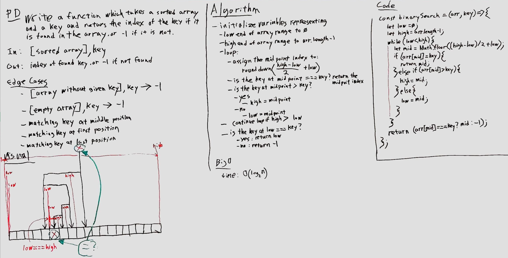
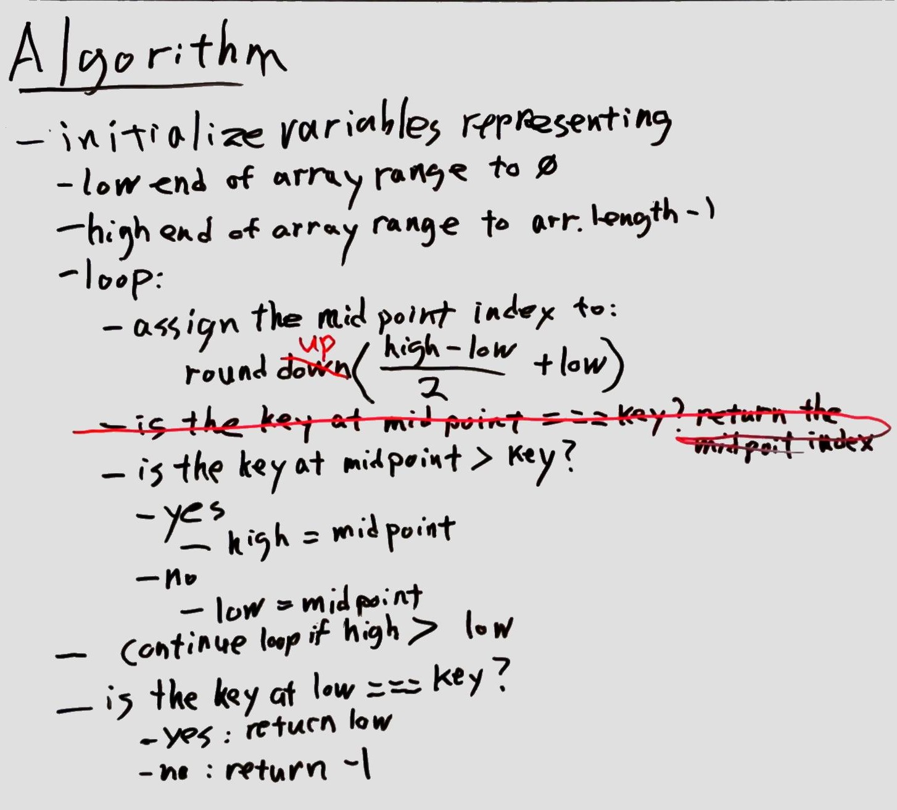
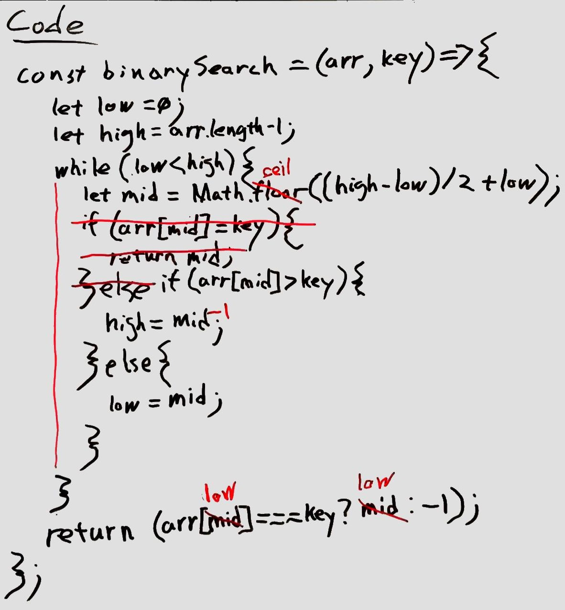

# Binary search in a sorted 1D array

## Challenge

Write a function which takes a sorted array and a key and returns the index of the key if it si found in the array, or -1 if it is not found.

## Approach & Efficiency

- initialize variables representing:
  - low end of the array range to 0
  - high end of array range to arr.length-1
  - loop while low is less than high
    - assign the midpoint index to (high-low) / 2 + low and round up
    - if the key at midpoint is greater than the given key
      - high end = midpoint-1
      - else low end - midpoint
  - loop
  - is the key at low end equal to the given key?
    - yes: return low end
    - no: return -1

## Solution

### Initial Whiteboard

### Optimized Algorithm

### Optimized & Corrected Code

### [Code](array-binary-search.js)
