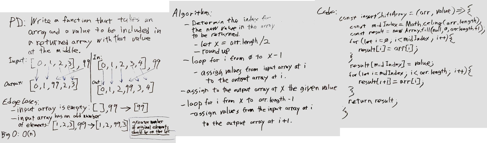

# Insert Into Array

## Challenge

Write a function that takes an array and a value to be included in a returned array with that value inserted at the middle.

## Approach & Efficiency

- Determine the index for the new value in the array to be returned
  - let x = arr.length / 2
  - then round up
- loop for i from 0 to x-1
  - assign values from input array at i to the output array at i
- assign to the output array at x the given value
- loop for i from x to arr.length-1
  - assign values from the input array at i to the output array at i+1.

## Solution

