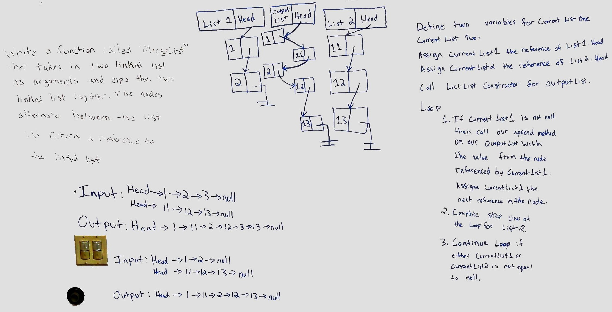
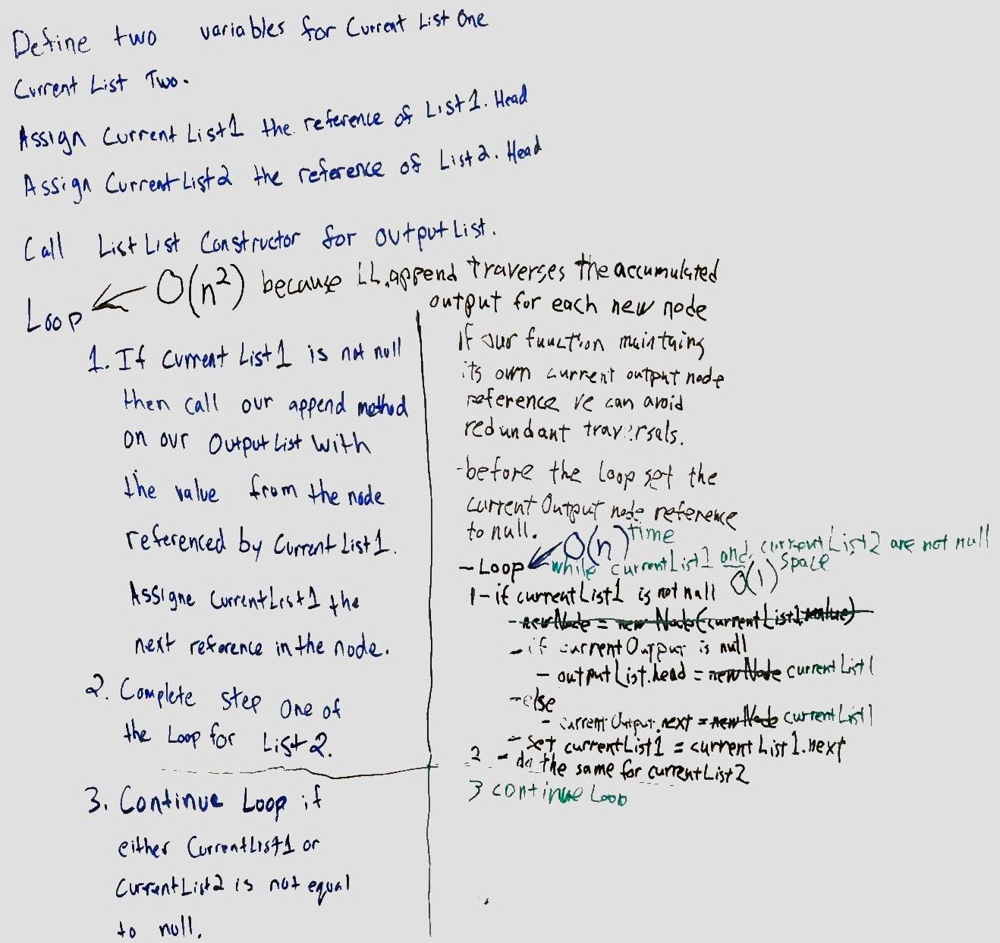
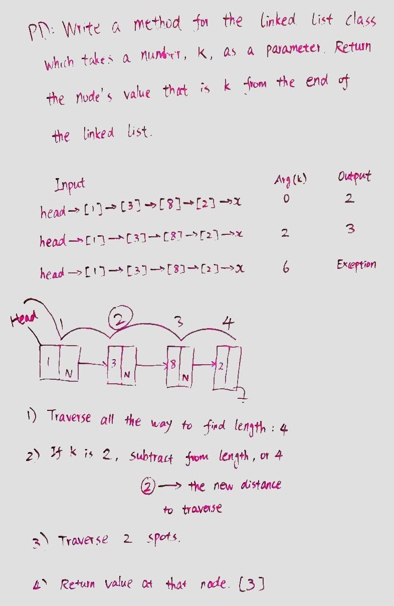
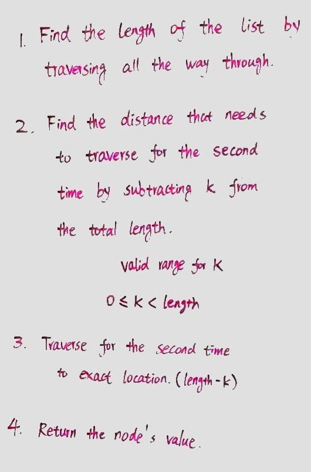
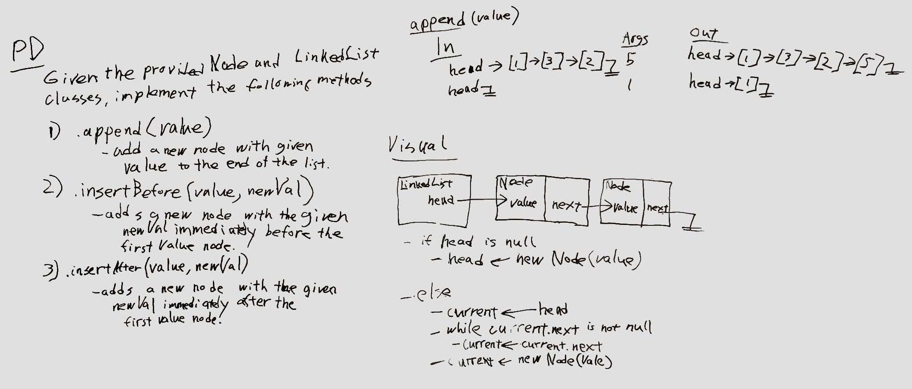
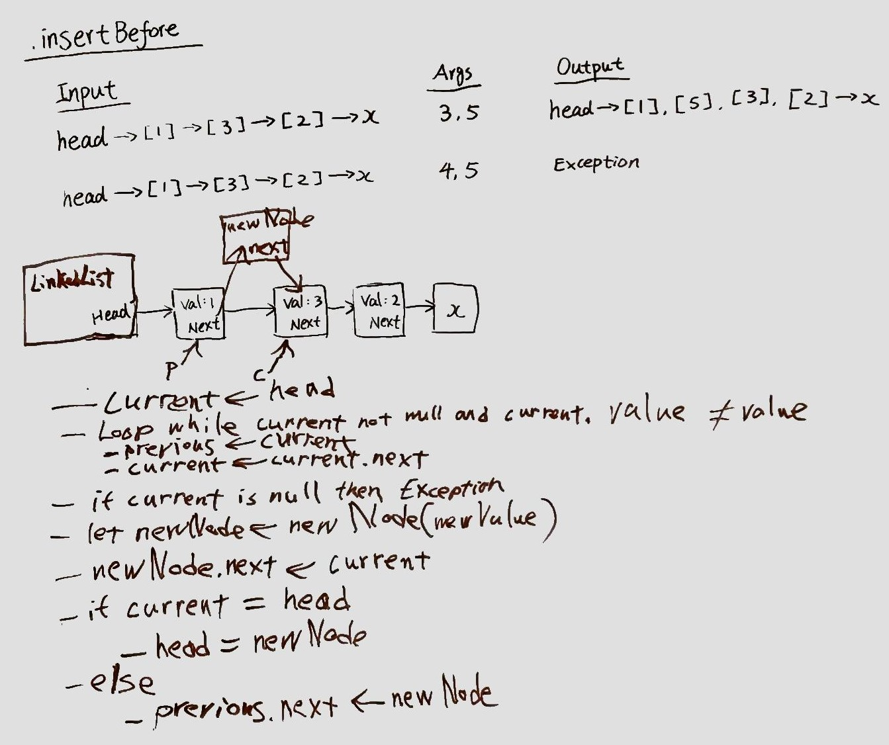
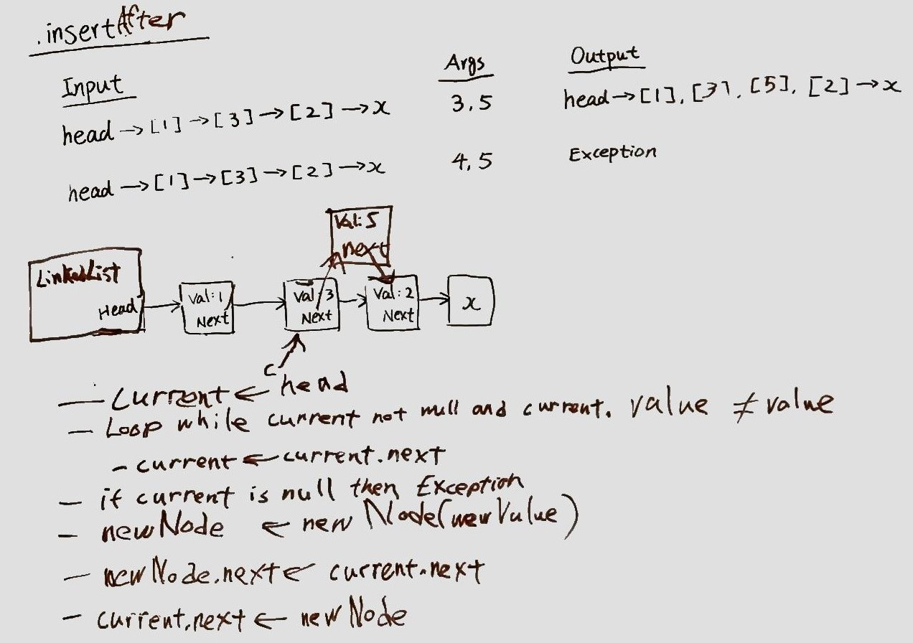

# Singly Linked List

An implementation of a class for creating and working with a singly linked list.

## Challenge

* Implement a Node class that stores a node value and a pointer to the next Node.
* Implement a LinkList class with the insert, includes, and toString methods described below.

## Approach & Efficiency

### insert(value)

* Create a new instance of Node with the given value and assign it to the nodeNode variable.
* Assign to newNode.next the reference in this.head.
* Assign to this.head a reference to the new instance.

This method has an O(1) time performance.

### includes(value)

* Set the local variable `current` to the Node reference in `this.head`.
* While `current` is not null, loop
  * If `current.value` is equal to the given value, return with `true`.
  * Set `current` to `current.next`
* return `false`.

This method has an O(n) time, and O(1) space performance.

### toString()

* Set the local variable `current` to the Node reference in `this.head`.
* Declare an empty array to receive Node values
* While `current` is not null, loop
  * push onto the array `current.value`
  * Set `current` to `current.next`
* Concatenate the array with the Array.prototype.join(',') method.

This method has an O(n) time, and O(n) space performance.

## API

### append(value)

Adds a new node with the given value to the end of the list.

### getLength()

Return the current count of nodes in the linked list.

### getNthNode(n)

Return the Node at the nth position in the linked list.

### includes(value)

Returns a boolean indicating if the given value is equal to any Node's value in the list.

### insert(value)

Takes any value as an argument and adds a new node with that value to the head of the list.

### insertAfter(value, newVal)

Adds a new node with the given value immediately after the first value node.

### insertBefore(value, newVal)

Adds a new node with the given newValue immediately before the first value node.

### kthFromEnd(k)

Given a number, k, return the value of the node that is k from the end of the linked list.

### toString()

Returns a string representing all the values in the linked list.

## [Code](linked-list.js)

# Merge two linked lists

## Challenge

Write a function called mergeLists which takes two linked lists as arguments. Zip the two linked lists together into one so that the nodes alternate between the two lists and return a reference to the head of the zipped list. Try and keep additional space down to O(1).

## Solution

### Approach & Efficiency

* General approach
  * using a current pointer and an alt pointer
    * set up for the loop and handle the edge condition of an empty list1.
    * in a loop while alt is not null
      * swap alt and current.next pointers
      * advance current to current.next
    * return list1;

### Whiteboard

Working together on whiteboard with Derrik Puetz.

#### Problem Domain and Visual

#### Optimization

### [Code](linked-list.js)

--------------------

# k-th value from the end of a linked list

## Challenge

Write a method for the Linked List class which takes a number, k, as a parameter, return the node’s value that is k from the end of the linked list.

## Solution

### Approach & Efficiency

### Overall Approach

* Write the following helper methods to perform the low level list traversals then use them to build our method:
  * .getLength() - Return the current count of nodes in the linked list.
  * .getNthNode(n) - Return the node at the nth position of the linked list, or throw an exception if there is none.

### .kthFromEnd(k)

* Using these low-level helper methods, write the .kthFromEnd(k) method as follows:
  * Assign to the length variable the length of the list as determined from the .getLength() method.
  * Determine that k is valid for the length of the list and throw an exception if not:
    * Valid values for k: 0 <= k < length
  * Assign to a temporary variable (foundNode) the node reference returned from the .getNthNode(length - k) method.
  * return the value of foundNode.value.

### .getLength() Pseudo-code

* let current = head
* let length = 0
* Loop while current is not null
  * add 1 to length
  * current = current.next
* return length

### .getNthNode(n) Pseudo-code

* let current = head
* let length = 0
* Loop while current is not null
  * add 1 to length
  * if length = n then return current
  * current = current.next
* if we finished the while loop before n was reached, throw an exception!

### Whiteboard

Working together on whiteboard with David Zheng.

#### Problem Domain and Visual

#### High Level Pseudo-code

#### .getLength() Pseudo-code

 Pseudo-code")

#### .getNthNode() Pseudo-code

 Pseudo-code")

### [Code](linked-list.js)

# Linked List Insertions

## Challenge

Add to our LinkedList class the following methods:

1. .append(value) - Adds a new node with the given value to the end of the list.

2. .insertBefore(value, newVal) - Adds a new node with the given newValue immediately before the first value node.

3. .insertAfter(value, newVal) - Adds a new node with the given value immediately after the first value node.

## Solution

### Approach & Efficiency

### .append(value)

* Create the new instance of Node with the given value and assign to the variable newNode a reference to it.
* If head is null
  * then assign newNode to head and return
  * else
    * set current to head
    * while current.next is not null
      * set current to current.next
    * set current.next to newNode and return

### .insertBefore(value, newVal)

* set current to linkedList.head
* loop while current is not null and current.value is not equal to value
  * set previous to current
  * set current to current.next
* if current is null then return an exception
* Create a new instance of Node with the given value and assign to the temporary variable newNode a reference to it.
* set newNode.next to current
* if current references the same node as linkedList.head
  * set linkedList.head to newNode
* else
  * set previous.next to newNode

### .insertAfter(value, newVal)

* set current to linkedList.head
* loop while current is not null and current.value is not equal to value
  * set current to current.next
* if current is null the return an exception
* Create a new instance of Node with the given value and assign to the temporary variable newNode a reference to it.
* set newNode.next to current.next
* set current.next to newNode

### Whiteboard

Working together on whiteboard with David Zheng.

#### append

#### insertBefore

#### insertAfter

### [Code](linked-list.js)
