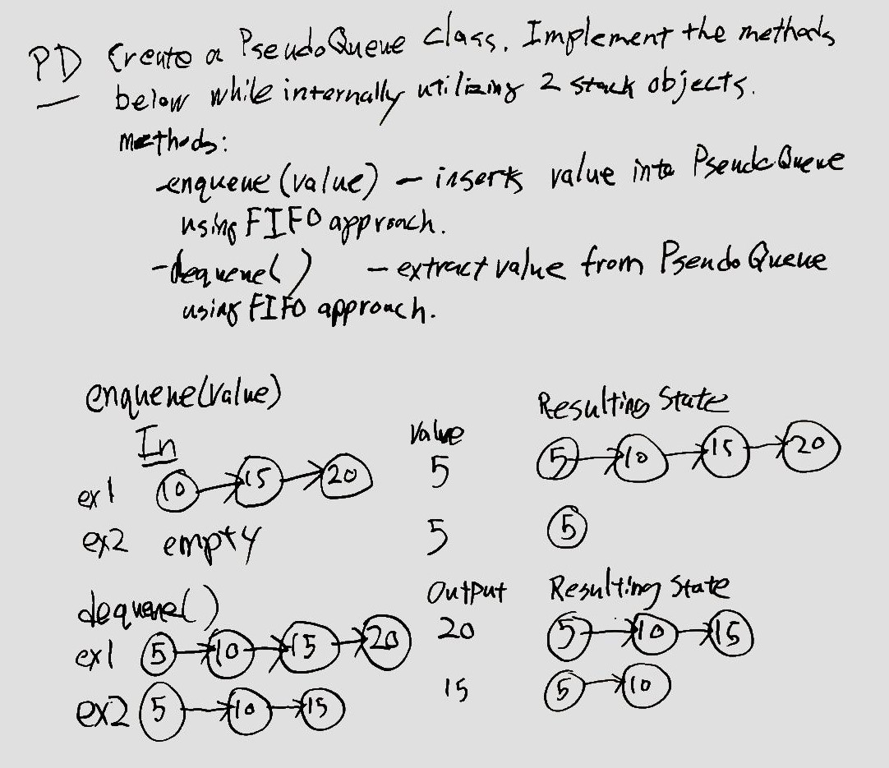
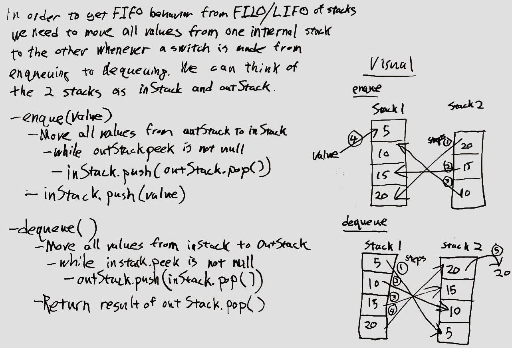
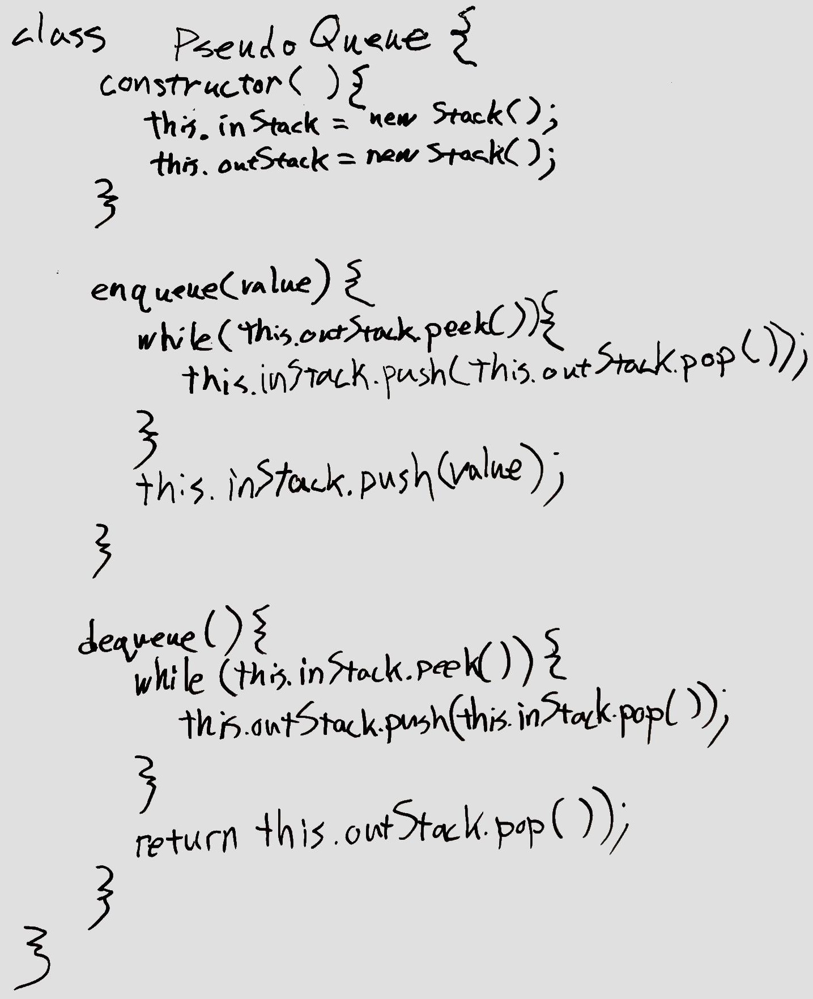

# Stacks and Queues

This is a JavaScript implementation of stack and queue data structures.

## API
<!-- Description of each method publicly available to your Stack and Queue-->

This implements the following objects and methods:

### Node

Used internally by the Stack and Queue objects to form linked lists to implement the stack and queue behaviors.

### Stack

Class that implements a stack.  It has the following methods.

* `push(value)` - Takes any value as an argument and adds a new node with that value to the top of the stack.
* `pop()` - Removes the node from the top of the stack, and returns the node’s value.
* `peek()` - Returns the value of the node located on top of the stack, without removing it from the stack.
* `isEmpty()` - Returns a boolean indicating if the stack is empty.

### Queue

Class that implements a queue.  It has the following methods.

* `enqueue(value)` - Takes any value as an argument and adds a new node with that value to the back of the queue.
* `dequeue()` - Removes the node from the front of the queue, and returns the node’s value.
* `peek()` - Returns the value of the node in the front of the queue without removing it.
* `isEmpty()` - Returns a boolean indicating if the queue is empty.

## [Code](stacks-and-queues.js)

-----------

# Implement a Queue using two Stacks

## Challenge
Create a PseudoQueue class without using an existing queue.  The class should implement a standard queue interface using the methods below but will internally utilize only two Stack objects.

Use only `push`, `pop`, and `peek` methods of the `Stack` instances.

The class should have the following methods.

* `enqueue(value)` - Inserts `value` into the PseudoQueue using a FIFO approach.
* `dequeue()` - Extracts a value from the PseudoQueue, using a FIFO approach.

## Approach & Efficiency
<!-- What approach did you take? Why? What is the Big O space/time for this approach? -->

In order to get FIFO behavior from FILO/LIFO stacks, we need to move
all values from one internal stack to the other whenever a switch is made from enqueuing to dequeuing.  We can think of the two stacks as
`inStack` and `outStack`.

### `enqueue(value)`

* move all values from `outStack` to `inStack`
  * while `outStack.peek()` is not `null`
    * `inStack.push(outStack.pop())`
* `inStack.push(value)`

### `dequeue()`

* move all values from `inStack` to `outStack`
  * while `inStack.peek()` is not `null`
    * `outStack.push(inStack.pop())`
* return value of `outStack.pop()`

## Solution
<!-- Embedded whiteboard image -->

### Problem Domain

### Approach, Visual, and Pseudo-code

### Whiteboard Code

## [Code](queueWithStacks/queue-with-stacks.js)
