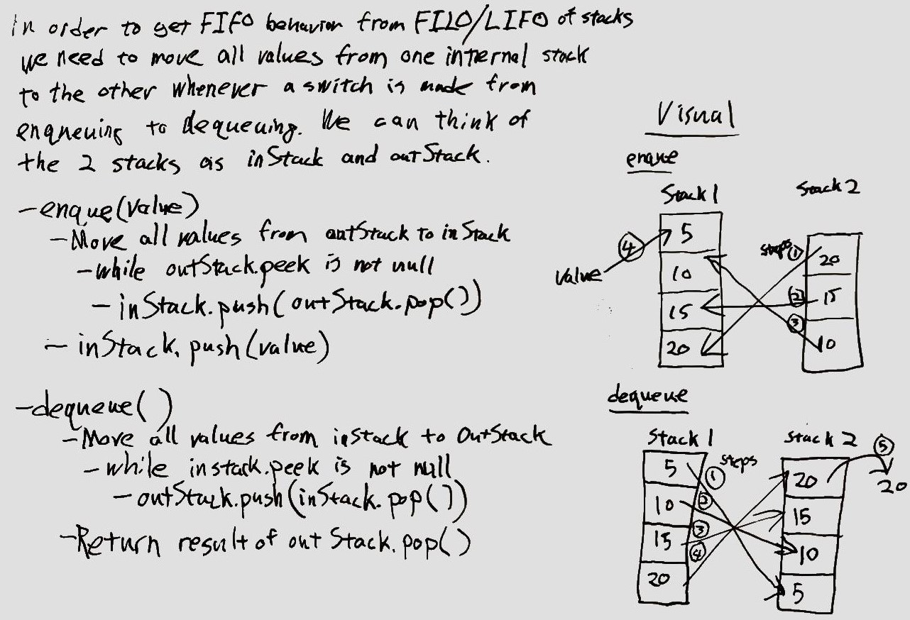

# Implement a Queue using two Stacks

## Challenge
Create a PseudoQueue class without using an existing queue.  The class should implement a standard queue interface using the methods below but will internally utilize only two Stack objects.

Use only `push`, `pop`, and `peek` methods of the `Stack` instances.

The class should have the following methods.

* `enqueue(value)` - Inserts `value` into the PseudoQueue using a FIFO approach.
* `dequeue()` - Extracts a value from the PseudoQueue, using a FIFO approach.

## Approach & Efficiency
<!-- What approach did you take? Why? What is the Big O space/time for this approach? -->

In order to get FIFO behavior from FILO/LIFO stacks, we need to move
all values from one internal stack to the other whenever a switch is made from enqueuing to dequeuing.  We can think of the two stacks as
`inStack` and `outStack`.

### `enqueue(value)`

* move all values from `outStack` to `inStack`
  * while `outStack.peek()` is not `null`
    * `inStack.push(outStack.pop())`
* `inStack.push(value)`

### `dequeue()`

* move all values from `inStack` to `outStack`
  * while `inStack.peek()` is not `null`
    * `outStack.push(inStack.pop())`
* return value of `outStack.pop()`

## Solution
<!-- Embedded whiteboard image -->

### Problem Domain

### Approach, Visual, and Pseudo-code

### Whiteboard Code

## [Code](queueWithStacks/queue-with-stacks.js)
