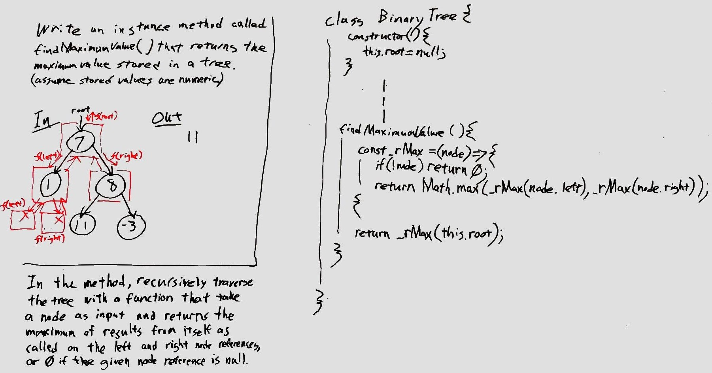

# Implementation: Trees

This is a JavaScript implementation of BinaryTree and BinarySearchTree data structures.

## API
<!-- Description of each method publicly available to your Stack and Queue-->

This implements the following objects and methods:

### Node

Used internally by the BinaryTree and BinarySearchTree objects.

### BinaryTree

Class that implements a BinaryTree.  It has the following methods.

* `preOrder()` - .
* `inOrder()` - .
* `postOrder()` - .
* `findMaximumValue()` - Instance method that returns the maximum value in the tree assuming.  Assumes the values stored are numeric.
* `()` - .

### BinarySearchTree

Class that implements a BinarySearchTree.  As implemented, this extends the BinaryTree class and adds to it the following methods.  For correct use, all additions to the tree must be done via the `add(value)` method.

* `add(value)` - Adds a new node with the given numeric value to the tree in the correct location.
* `contains(value)` - Returns a boolean indicating whether the value is in the tree.
<!-- * `findMaximumValue()` - Same functionality as for BinaryTree, but simply returns the value of the right-most node in order to achieve O(ln n) time. -->
<!-- * `balance()` - Balances the tree. -->

## [Code](tree.js)

***

# Find Maximum Value in a Binary Tree

## Challenge Summary
<!-- Short summary or background information -->
Find the maximum value in a binary tree.

## Challenge Description
<!-- Description of the challenge -->
Write an instance method called `findMaximumValue` that returns the maximum value stored in a binary tree.  Assume that values stored in the tree are numeric.

## Approach & Efficiency
<!-- What approach did you take? Why? What is the Big O space/time for this approach? -->

## Solution
<!-- Embedded whiteboard image -->

### Whiteboard

## [Code](tree.js)
