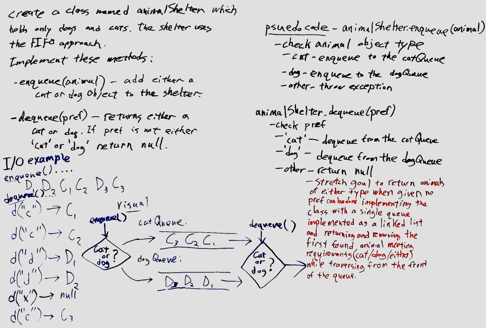

# Challenge Summary
<!-- Short summary or background information -->
First-in, First-out Animal Shelter.

## Challenge Description
<!-- Description of the challenge -->
Create a class named animalShelter which holds only dogs and cats. The shelter uses the FIFO approach and implements the following methods:

* enqueue(animal) - Adds either a Cat or Dog object to the shelter.

* dequeue(pref) - Returns either a Cat or Dog object. If pref is not either 'cat' or 'dog', returns null.

## Approach & Efficiency
<!-- What approach did you take? Why? What is the Big O space/time for this approach? -->

We used two internal queues, one catQueue, one dogQueue.  Conditionally by object type (Dog vs. Cat) enqueue(animal) will queue the animal to the catQueue vs. dogQueue.

The dequeue(pref) method will dequeue and return from the catQueue vs. dogQueue based on the pref parameter of 'cat' or 'dog', or return null if neither 'cat' nor 'dog' is specified.

Time for both methods is O(1) regardless of the number of objects already queued.  Space for the object is O(n) and added spaced used by the methods is O(1).

## Solution
<!-- Embedded whiteboard image -->

### Whiteboard

## [Code](fifo-animal-shelter.js)
