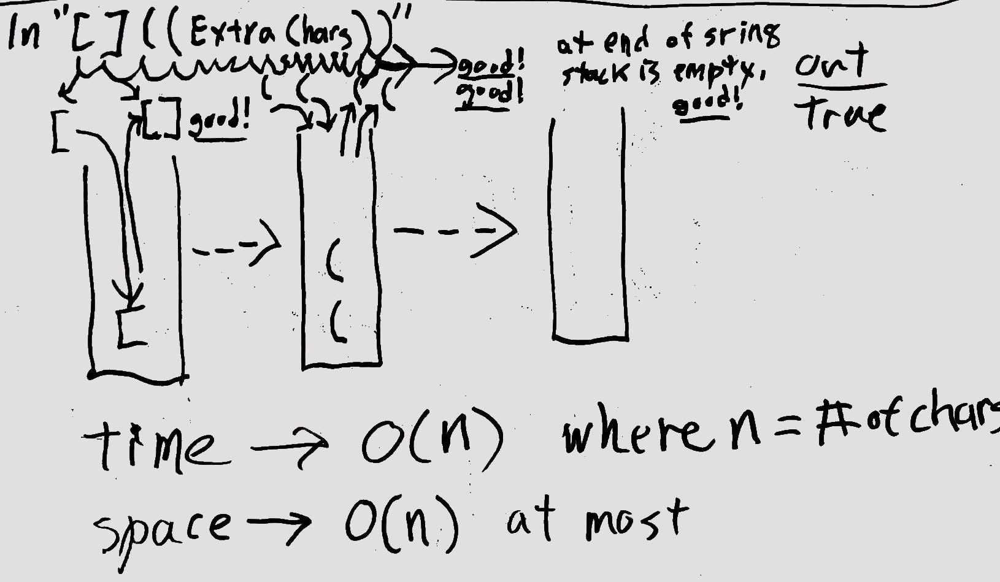

# Challenge Summary
<!-- Short summary or background information -->
Multi-bracket Validation.

## Challenge Description
<!-- Description of the challenge -->
Write a function called multiBracketValidation(input) takes a string as input and returns a boolean indicating if the brackets in the string are balanced.  The function should consider three types of brackets:

* Round - `()`
* Square - `[]`
* Curly - `{}`

## Approach & Efficiency
<!-- What approach did you take? Why? What is the Big O space/time for this approach? -->
In order to ensure that brackets were properly balanced a stack was used to compare opening brackets with closing matching closing brackets.  This approach has a time consideration of O(n) (where n is the number of characters in the input string) and a space consideration of O(n) in the worst case where the input is all opening brackets.

## Solution
<!-- Embedded whiteboard image -->

### Whiteboard

### Whiteboard Visual

## [Code](multi-bracket-validation.js)
